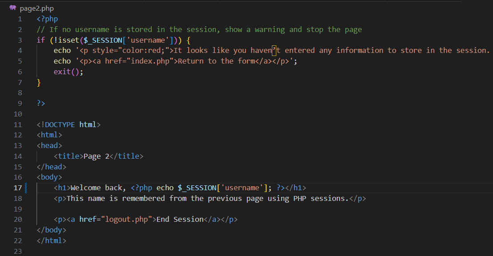

# Introduction
PHP: Hypertext Processor, also known as PHP, is a widely used, open source scripting language employed by many web developers because of its ability to run and store information on a server. Rather than storing sensitive information in the user’s browser which could easily be accessed and manipulated by malicious scripts and browser extensions, PHP code defends the security of the user’s data by keeping all of the information in a web server. This information can be additionally defended in PHP through password hashing, as passwords are registered directly with the server, processed by PHP code, hashed by PHP code, and then stored into the database with potential threat actors unable to access the original password.

 

PHP code is also useful for its ability to update data dynamically and persist across different kinds of browsers. Given that data is processed and stored manually on the server through client interactions with the PHP, users have the potential to interact with and update the same shared data. This facilitates online interactions as clients can view, modify, and share datasets which are stored internally on the web server (like social media posts). The other advantage to PHP coding is that it allows users to access their data on different devices and different browsers, a capability that local storage, which is limited to a single browser on a single device, cannot provide.

 

To manage and track these interactions securely across multiple pages and to ensure that each user’s data and interactions remain consistent as they navigate a website, PHP employs sessions, which store user-specific information on the server. Sessions are particularly useful for users who jump across multiple tabs on a website because they provide the necessary credentials to ensure that the user remains logged in. Picture Amazon’s webpage and imagine how frustrating it would be if every time a user clicked on a product, they were forced to enter in their username and password. PHP sessions facilitate that process. They store a user’s login state on the server and link that logged-in status to a unique session ID on the browser. As a result, when the user revisits the webpage through the same browser at a later time, the browser provides the same session ID which connects with the server’s database.

 
With this understanding, we can now dive into the step-by-step process of setting up and using sessions in PHP, so you can implement secure, persistent user interactions on your own website. The final product of this tutorial should be a login page where a user submits their username, a welcome page, a secondary page to prove the session saved the user's data, and a logout page. In each step of the following sections, there will be both a specific list of instructions that the user should follow, followed by an explanation. Each is labelled as such.

 

# Initial Setup
#### Instructions:

Follow this tutorial to install docker: https://learn.microsoft.com/en-us/windows/wsl/tutorials/wsl-containers#install-docker-desktop

 

Clone this repository in the directory of your choice. Click on the green `<>Code` button in this github repository and copy the https link. Navigate to the directory of your choice in the terminal, type git clone and then paste the link you copied before.

 

In your directory should now be 6 files: docker-compose-yml, Dockerfile, index.php, logout.php, page2.php, and welcome.php. Pull up your terminal, navigate to this directory and type the following: docker-compose up. Your docker application should now be running a local host that you can visit by typing in the following: `http://localhost:4000/index.php`.

# Tutorial

### Step 1: Create a basic HTML form
Open your `index.php file`. In the body section underneath the first paragraph tag, create an HTML form element: `<form>``</form>`

 
Inside your form element, create an input HTML element that asks the user for text. It should also have a special id with a name of your choosing attached and be marked as a required field. Finally, add the right before the "required" attribute the following text: `<name="username">`. 

 
Just before your input, create a label that uses the unique id you established previously. This should attach it to your input element and allow you to prompt the user to type something. Make sure the label says something along the lines of: "Enter your name."

 
Immediately after your input element, create a submit button with type submit.

 

Return to your form element tag. Within the `<form>` tag, add the following: `action="welcome.php" method="POST"`. What this is doing is telling the form to send the data to the welcome.php file via POST. POST is one of the HTTP request methods used by a browser to send data to a server, which in our case will be the welcome.php file.

 
If you have followed all of the instructions correctly, your HTML should look something like this:  

 

### Step 2: Creating a second .php file to initialize a session\
Navigate to your `welcome.php` file. At the top of the file, type the following:`<?php session_start(); ?>`.  

### Step 2: Initialize and set your global session variable
Instructions: Type at the top of your php file the following: `<?php session_start(); ?>`. What this is essentially doing is creating a new session or resuming an existing one. This should be called before anything is sent to the browser as an output. 

 

Directly after the semicolon and before the question mark and carrot, add a conditional if statement followed by the PHP function `<isset(){}>`. This function essentially checks if a variable exists and is not null.

 

Within the `<isset(){}>` function, add the following within the parentheses: `<$_POST['username']>`. This is drawing upon the username you posted in your index.php file. **Note: the data exists only for that request. If you reload the page or go to another page, the POST data is gone unless you resend it.** So the overall logic of the statement is if welcome.php received the POST variable, run the following code within the brackets.

 

In the brackets, type the following: `$_SESSION['username'] = $_POST['username'];`. Here we are finally setting our global session variable which will be used in the rest of the php files we create.

 

A quick expanation: There is a special global session array denoted as `$_SESSION` for php code. What this means is that there is an empty special list (or storage box) of data which can be called upon by any php page after adding `session_start();`. In order to add data into the list, you must type something similar to the following: `$_SESSION['username'] = 'kate';`. In this case, the data you are storing is in the form of what is called a key-value pair. In this case, `'username'` is the key. A key is the label or name for a piece of data. In this case, it is the label/name for `'kate'`, which is the actual value we are storing. This will be important when we create our page2.php file.

 

Navigate to the html code at the bottom of your file. In the body tag, paste the following: `<h1>Hi, <?php echo $_SESSION['username']; ?>!</h1> 
Your name is now saved in the session.
 
<a href="page2.php">Go to Page 2</a>
`

 

In the header function, you are calling on your global session variable and printing it to the browser. In the second paragraph tag, you are creating a reference attribute that will redirect users to `page2.php`

 
Your welcome.php file should look something like this:

 

### Step 3: Calling your session variable
Navigate to `page2.php`. Intialize your session by typing `<?php session_start(); ?>` at the top. Afterwards, navigate to your HTML code and in the header, create a PHP function where you call your session using the `echo` command, i.e. `<?php echo $_SESSION['username']; ?>`. Make sure this line of code follows your welcome back statement.

 

**Note: The additional php statement at the top of the file is verifying whether the session variable exists or not. If it doesn't, it sends a warning and prompts the user to return to index.php**

 

Your final page2.php file should look something like this:

### Step 4: Clearing your session variables
Navigate to `logout.php`. Here, we are going to clear out our session variables. To do this, we start our session with the same command: `<?php session_start(); ?>`. Then, immediately after the session_start function (still within the carrots and before the question mark), type the following: `session_unset();`. This will clear your global session array of all key-value pairs. For security reasons, we will then destroy the session by typing `session_destroy();` directly after `session_unset();` within the carrots and just before the question mark.

 

Your final login.php file should look something like this:

 

# Implementation
Navigate to `http://localhost:4000/index.php`. It should ask you for a login. Enter whatever you want and hit enter. The next page should welcome you using the username you provided. It will also give you a prompt to navigate to page 2. If you click that link, on the next page, it should welcome you again with the same username you provided. This is remarkable because HTTP is a stateless protocol, meaning that each HTTP request works independently of any other request. In other words, without a session variable attached to your username, the server would treat every request as brand new and would require you to resubmit all of the data you had previously entered in on the past page. Continue to your logout.php and then return to the start. Now, instead of clicking through each php file, try typing `http://localhost:4000/page2.php`. This will throw up an error on the browser because your session has been cleared and destroyed. You would need to create an entirely new session to access `page2.php` again. This would not be the case if you navigated to `page2.php` and then tried to type in `http://localhost:4000/welcome.php`. This request would work because you have not cleared your session and as a result, you could return to welcome.php without any errors dispayed in the top section. Additionally, `welcome.php` would welcome you with the same username you provided on the login page because the session has the data stored in its global array (aka its global list).

# References
* https://www.php.net/manual/en/language.variables.superglobals.php Defines global variables such as POST and SESSION and explains their purpose and limited capabilities.
* https://www.geeksforgeeks.org/php/advantages-and-disadvantages-of-php/ Describes the advantages and disadvantages of php code
* https://www.w3schools.com/php/php_sessions.asp Provides an alternate definition of PHP sessions and gives certain examples of session being implemented.
* https://www.freecodecamp.org/news/stateful-vs-stateless-architectures-explained/ - Provides information about HTTP being a stateless protocol
* https://www.php.net/manual/en/book.session.php - Provides a whole dictionary of functions that can be attributed to PHP sessions
* https://learn.microsoft.com/en-us/windows/wsl/tutorials/wsl-containers#install-docker-desktop This is the docker install tutorial provided at the top
